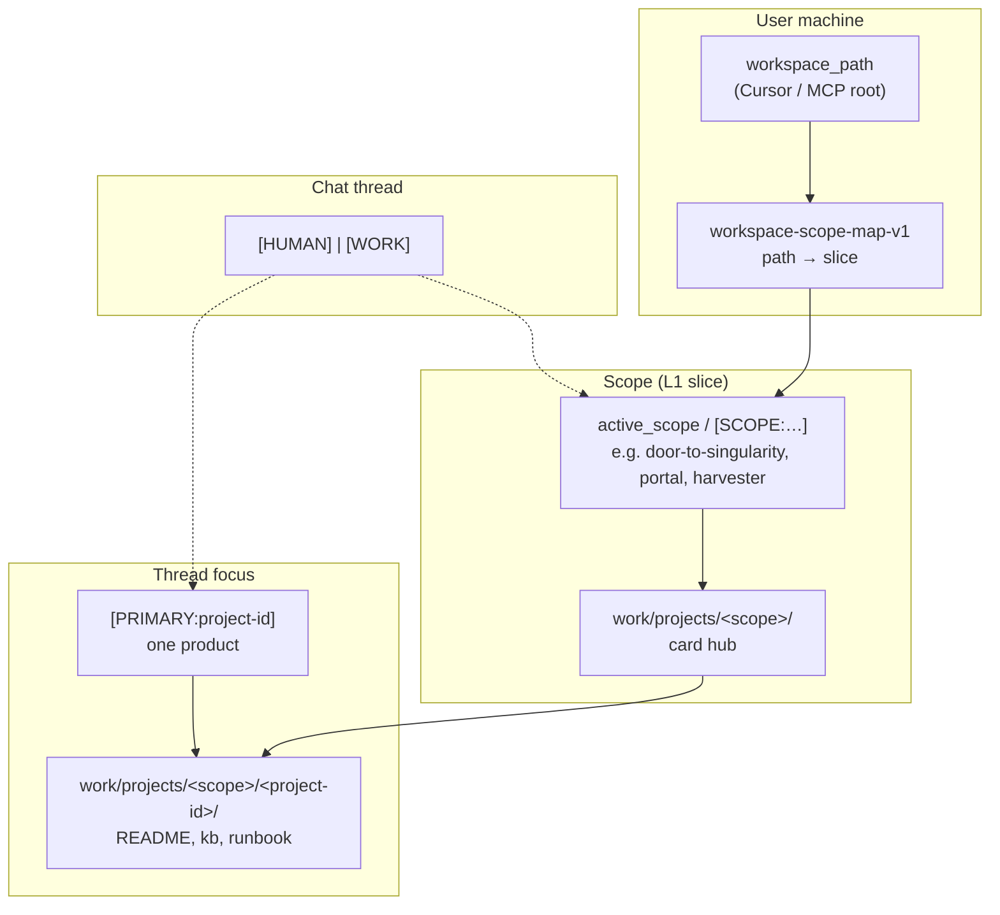
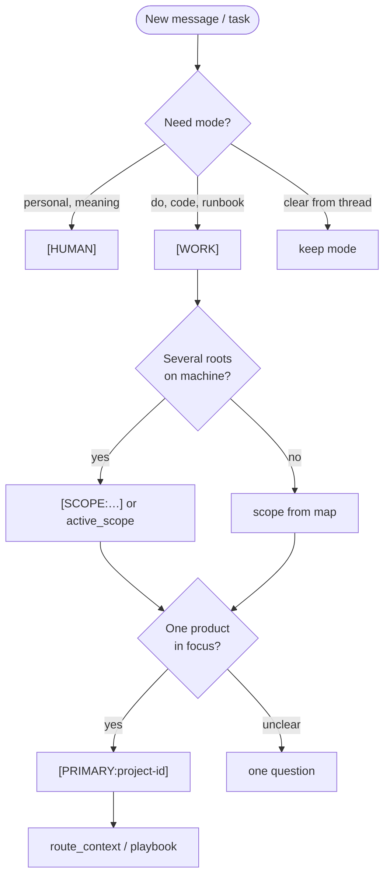

# KB protocols and entities

**Three KB contours:** [Three contours map](../onboarding/three-contours.md)

**Version:** v1 · **2026-05-16**

One-pager: markers **`[HUMAN]`** / **`[WORK]`**, **`[PRIMARY:…]`**, **`[SCOPE:…]`** — what, why, when. Scope / Project / workspace diagrams.

**In repo (same text):** [kb-protocols-and-entities-one-pager-v1.md](../knowledge/kb-protocols-and-entities-one-pager-v1.md)  
**Layers L0–L3 and publishing:** [kb-one-pager-structure-and-protocols-v1.md](../knowledge/kb-one-pager-structure-and-protocols-v1.md)

See also: [Memory and KB](../guide/memory-and-kb.md) · [FAQ](../guide/faq.md) · [30-minute onboarding](../onboarding/quick-start-30min.md)

---

## In 60 seconds

| Question | Answer |
|----------|--------|
| What to write in chat? | Markers **`[HUMAN]`** / **`[WORK]`**, **`[PRIMARY:…]`**, **`[SCOPE:…]`** — tables below. |
| What wins? | Marker in **this** message → install map default → path heuristic (does not override recent thread marker). |
| Scope vs Primary? | **SCOPE** — “which workspace universe”; **PRIMARY** — “which product is in focus”. |
| Full text? | [playbook-multi-project-context-v1.md](../knowledge/worlds/workspace-context/playbook-multi-project-context-v1.md); hot `agent-notes.md` (protocols in full canon often below `<!-- public-cut -->`). |

---

## Message markers

### Thread mode: `[HUMAN]` and `[WORK]`

| Marker | When | Agent behavior | Default |
|--------|------|----------------|---------|
| **`[HUMAN]`** | reflection, personal, emotions, meaning, “talk” | no runbook unless asked; respects personal contour | **yes** until `[WORK]` |
| **`[WORK]`** | task, code, KB, runbook, “do it”, verification | execution, tools, checklists | after explicit `[WORK]` in thread |

**Rule:** one thread — one stable mode until switched by marker or phrase (“switching to work”).

Org level (values, boundaries): [handbook — mode protocol](https://github.com/AI-Guiders/handbook/wiki).

---

### Task focus: `[PRIMARY:…]` and `[SCOPE:…]`

| Marker | When | Sets | Example |
|--------|------|------|---------|
| **`[PRIMARY:<id>]`** | one product/repo in focus **this** thread | `project-id`, product contract | `[PRIMARY:cascade-ide]` or `[PRIMARY:CIDE]` |
| **`[SCOPE:<slice>]`** | several workspace roots on machine | `active_scope` in MCP, L1 hot | `[SCOPE:door-to-singularity]` or `[SCOPE:DTS]` |

**Do not confuse:**

- **`[PRIMARY:EDWH]`** → Harvester repo (`edw-harvester`).
- **`[SCOPE:HRV]`** → slice `harvester` (L1 memory), not the same as PRIMARY.

**Resolution priority:**

1. Marker in current message.
2. Default from **`workspace-scope-map-v1`** (canon owner hot `agent-notes.md`).
3. File-path heuristic — must **not** silently override step 1.

Details: [playbook-multi-project-context-v1.md](../knowledge/worlds/workspace-context/playbook-multi-project-context-v1.md) §6–6c.

---

## Entities: what is what

Terms are **not interchangeable**.

| Entity | Level | Why |
|--------|-------|-----|
| **workspace_path** | MCP / Cursor | physical repo root on disk |
| **scope** (`active_scope`) | L1 | do not mix monorepo and separate Portal root |
| **project-id** + **PRIMARY** | task focus | one product card |
| **world** (KE) | router domain | stack/tools — **not** scope |
| **domain** (router) | query topic | which playbook/kb to load |

Mixed worlds: [kb-knowledge-engineering-mixed-worlds-rules-v1.md](../knowledge/worlds/knowledge-engineering/kb-knowledge-engineering-mixed-worlds-rules-v1.md).

> **kb-public** has no `knowledge/work/` tree — expected ([PUBLISHING.md](../knowledge/PUBLISHING.md)). `project-id` cards live in the owner’s full canon.

---

## Example scope and project-id (not a global standard)

### Scope (`[SCOPE:…]` → canon)

| Marker / legacy | Canon | When |
|-----------------|-------|------|
| `DTS`, `current-projects` | `door-to-singularity` | home monorepo, DTS hub |
| `PTL` | `portal` | Portal line |
| `HRV` | `harvester` | EDW Harvester |
| `mixed` | `mixed` | several slices in one session |

### Primary — common aliases

| `[PRIMARY:…]` | Canon | Why |
|---------------|-------|-----|
| `CIDE` | `cascade-ide` | Avalonia IDE |
| `ANKB` | `agent-notes-kb` | KB canon, META |
| `ANM` | `agent-notes-mcp` | agent-notes MCP |
| `DTS` | `door-to-singularity` | workspace hub |

Define **your** ids for your repos; table illustrates one install.

---

## MCP (not chat markers)

| Tool / parameter | When |
|------------------|------|
| **`read_hot_context`** | session start, scope change |
| **`route_context(query)`** | what to load by topic (router-first; group KB overlay — [ADR 015](https://github.com/AI-Guiders/agent-notes-mcp/blob/main/docs/adr/015-multi-root-knowledge-roots-v1.md)) |
| **`read_knowledge_file`** | specific playbook/kb; `knowledge_root_id=group` — `{ORG_SLUG}/kb` (read-only) |
| **`active_scope`** | set slice without chat marker |
| **write** | **primary** only (personal canon); group/public read-only |

Multi-canon: [ADR 012](../knowledge/adr/012-multi-canon-workspace-resolution-v1.md) · contours: [Three contours](../onboarding/three-contours.md)

---

## When to use what

---

## Next steps

| Need | Link |
|------|------|
| Anti-OOM overview | [SHOWCASE.md](../knowledge/SHOWCASE.md) |
| Router | [index-knowledge-router-v1.md](../knowledge/index-knowledge-router-v1.md) |
| Multi-project | [playbook-multi-project-context-v1.md](../knowledge/worlds/workspace-context/playbook-multi-project-context-v1.md) |
| Layers and `work/`/`personal/` | [kb-one-pager-structure-and-protocols-v1.md](../knowledge/kb-one-pager-structure-and-protocols-v1.md) |
| Integrity | [integrity-core.md](../knowledge/META/integrity-core.md) |
