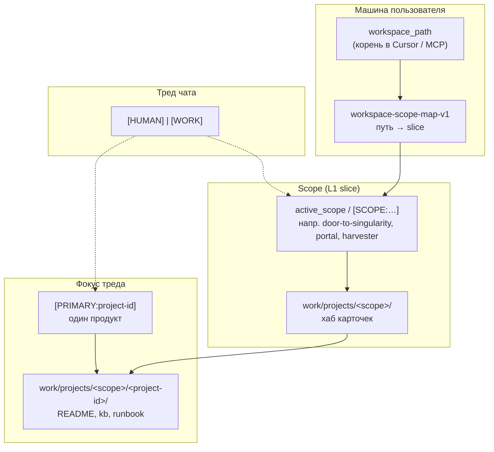
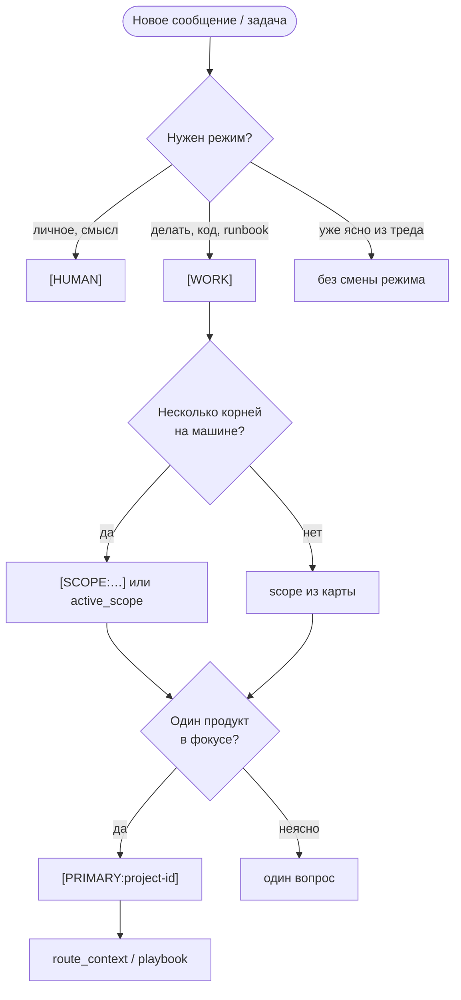

# Протоколы и сущности KB

**Три контура KB:** [Карта-трёх-контуров-KB](three-contours.md)

**Версия:** v1 · **2026-05-16**

One-pager: маркеры **`[HUMAN]`** / **`[WORK]`**, **`[PRIMARY:…]`**, **`[SCOPE:…]`** — что, зачем и когда. Схемы Scope / Project / workspace.

**В репозитории (тот же текст):** [knowledge/kb-protocols-and-entities-one-pager-v1.md](../knowledge/kb-protocols-and-entities-one-pager-v1.md)  
**Слои L0–L3 и публикация:** [kb-one-pager-structure-and-protocols-v1.md](../knowledge/kb-one-pager-structure-and-protocols-v1.md)

См. также: [Память-и-KB-как-устроено](../guide/memory-and-kb.md) · [FAQ-быстрый-вход](../guide/faq.md) · [Onboarding-за-30-минут](quick-start-30min.md)

---

## За 60 секунд

| Вопрос | Ответ |
|--------|--------|
| Что писать в чате? | Маркеры **`[HUMAN]`** / **`[WORK]`**, **`[PRIMARY:…]`**, **`[SCOPE:…]`** — см. таблицы ниже. |
| Что важнее? | Маркер в **этом** сообщении → дефолт из карты установки → эвристика по пути файла (не отменяет недавний маркер в треде). |
| Scope vs Primary? | **SCOPE** — «в какой вселенной workspace»; **PRIMARY** — «какой продукт в фокусе». |
| Где полный текст? | [playbook-multi-project-context-v1.md](../knowledge/worlds/workspace-context/playbook-multi-project-context-v1.md); hot `agent-notes.md` (протоколы в полном каноне часто ниже `<!-- public-cut -->`). |

---

## Маркеры в сообщениях

### Режим треда: `[HUMAN]` и `[WORK]`

| Маркер | Когда | Что делает агент | По умолчанию |
|--------|--------|------------------|--------------|
| **`[HUMAN]`** | рефлексия, личное, эмоции, смысл, «поговорить» | не уходит в runbook без запроса; уважает personal-контур | **да**, пока не появился `[WORK]` |
| **`[WORK]`** | задача, код, KB, runbook, «сделай», проверка | исполнение, инструменты, чеклисты | после явного `[WORK]` в треде |

**Правило:** один тред — один устойчивый режим, пока не переключили маркером или фразой («переходим в work»).

Орг-уровень (ценности, границы): [handbook — протокол режимов](https://github.com/AI-Guiders/handbook/wiki).

---

### Фокус задачи: `[PRIMARY:…]` и `[SCOPE:…]`

| Маркер | Когда | Что задаёт | Пример |
|--------|--------|------------|--------|
| **`[PRIMARY:<id>]`** | один продукт/репо в фокусе **этого** треда | `project-id`, техконтракт продукта | `[PRIMARY:cascade-ide]` или `[PRIMARY:CIDE]` |
| **`[SCOPE:<slice>]`** | несколько корней workspace на машине | `active_scope` в MCP, L1 hot-context | `[SCOPE:door-to-singularity]` или `[SCOPE:DTS]` |

**Не путать:**

- **`[PRIMARY:EDWH]`** → репозиторий Harvester (`edw-harvester`).
- **`[SCOPE:HRV]`** → slice `harvester` (память L1), не то же самое, что PRIMARY.

**Приоритет резолва:**

1. Маркер в текущем сообщении.
2. Дефолт из **`workspace-scope-map-v1`** (у владельца канона в hot `agent-notes.md`).
3. Эвристика по пути к файлу — **не** должна молча перебивать маркер из шага 1.

Развёрнуто: [playbook-multi-project-context-v1.md](../knowledge/worlds/workspace-context/playbook-multi-project-context-v1.md) §6–6c.

---

## Сущности: что есть что

Термины **не взаимозаменяемы**.

| Сущность | Уровень | Зачем |
|----------|---------|--------|
| **workspace_path** | MCP / Cursor | физический корень репозитория на диске |
| **scope** (`active_scope`) | L1 | не смешивать monorepo и отдельный корень Portal |
| **project-id** + **PRIMARY** | фокус задачи | одна карточка продукта |
| **world** (KE) | домен роутера | стек/инструменты — **не** scope |
| **domain** (роутер) | тема запроса | какой playbook/kb подтянуть |

Mixed worlds: [kb-knowledge-engineering-mixed-worlds-rules-v1.md](../knowledge/worlds/knowledge-engineering/kb-knowledge-engineering-mixed-worlds-rules-v1.md).

> В **kb-public** нет дерева `knowledge/work/` — это ожидаемо ([PUBLISHING.md](../knowledge/PUBLISHING.md)). Карточки `project-id` живут в полном каноне владельца.

---

## Пример scope и project-id (не глобальный стандарт)

### Scope (`[SCOPE:…]` → канон)

| Маркер / legacy | Канон | Когда |
|-----------------|-------|--------|
| `DTS`, `current-projects` | `door-to-singularity` | домашний monorepo, DTS-хаб |
| `PTL` | `portal` | линия Portal |
| `HRV` | `harvester` | EDW Harvester |
| `mixed` | `mixed` | несколько slice в одной сессии |

### Primary — частые алиасы

| `[PRIMARY:…]` | Канон | Зачем |
|-------------|-------|--------|
| `CIDE` | `cascade-ide` | IDE Avalonia |
| `ANKB` | `agent-notes-kb` | канон KB, META |
| `ANM` | `agent-notes-mcp` | MCP agent-notes |
| `DTS` | `door-to-singularity` | хаб workspace |

Заведи **свои** id под свои репозитории; таблица — иллюстрация одной установки.

---

## MCP (не маркеры чата)

| Инструмент / параметр | Когда |
|----------------------|--------|
| **`read_hot_context`** | старт сессии, смена scope |
| **`route_context(query)`** | что грузить по теме (router-first; overlay group KB — [ADR 015](https://github.com/AI-Guiders/agent-notes-mcp/blob/main/docs/adr/015-multi-root-knowledge-roots-v1.md)) |
| **`read_knowledge_file`** | конкретный playbook/kb; `knowledge_root_id=group` — [AI-Guiders/kb](https://github.com/AI-Guiders/kb) (только чтение) |
| **`active_scope`** | задать slice без маркера в чате |
| **запись** | только **primary** (личный канон); group/public — read-only |

Multi-canon: [ADR 012](../knowledge/adr/012-multi-canon-workspace-resolution-v1.md) · контуры: [Карта-трёх-контуров-KB](three-contours.md)

---

## Когда что использовать

---

## Куда дальше

| Нужно | Ссылка |
|--------|--------|
| Анти-OOM обзор | [SHOWCASE.md](../knowledge/SHOWCASE.md) |
| Роутер | [index-knowledge-router-v1.md](../knowledge/index-knowledge-router-v1.md) |
| Мультипроект | [playbook-multi-project-context-v1.md](../knowledge/worlds/workspace-context/playbook-multi-project-context-v1.md) |
| Слои и `work/`/`personal/` | [kb-one-pager-structure-and-protocols-v1.md](../knowledge/kb-one-pager-structure-and-protocols-v1.md) |
| Целостность | [integrity-core.md](../knowledge/META/integrity-core.md) |
