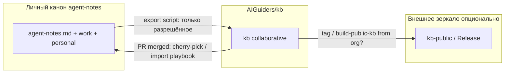

# ADR 011: Организация AIGuiders и репозиторий совместной KB (`AIGuiders/kb`)

**Статус:** Proposed (на обсуждение)  
**Дата:** 2026-05-15  
**Источник в истории:** перенос open-репозиториев в GitHub-организацию [AIGuiders](https://github.com/AIGuiders); запрос на отдельный **живой** контур KB для коллаборации (общие линии, совместное пополнение), не только read-only зеркало `kb-public`.  
**Supersedes:** —  
**Extended by:** —  
**Связано:** [001](001-kb-public-publishing-pipeline.md), [007](007-kb-project-constitution.md), [008](008-workspace-scope-map-hot-mcp-and-public-cut.md), [003](003-multi-project-scope-and-project-cards.md)

---

## Терминология (зафиксировать в обсуждениях)

| Термин | Репозиторий / артефакт | Смысл |
|--------|------------------------|--------|
| **Личный канон** | `agent-notes` (у держателя канона) | SSOT **владельца**: `work/`, `personal/`, hot ниже `public-cut`, карты путей, операционный спринт. Не «единый канон для всех», а **приватный полный** слой. |
| **Организационная KB** (org-kb) | `AIGuiders/kb` (предлагается) | **Совместный** текст знаний: PR, общие линии, без `work/`/`personal/`. |
| **Публичный срез** | `kb-public` / release | Read-only **выгрузка** (часто зеркало): CC BY-SA, обрезанный hot, тот же фильтр, что и старт org-kb. |
| **Open-код** | `AIGuiders/*` (MCP, CIDE, Core, …) | Исходники и NuGet; не путать с текстом KB. |

Далее в ADR: **личный канон** вместо устаревшего «полный канон» (который звучит как общий SSOT для мира).

---

## Контекст

Сейчас в экосистеме фактически **три роли** контента знаний (+ код), но названия путаются — см. таблицу выше.

Появление **организации AIGuiders** на GitHub поднимает вопрос: нужен ли **организационный** контур — репозиторий, куда **участники org** вносят общие линии (playbook/kb/worlds), с PR и review, **без** доступа к **личному канону** и **без** утечки машинных путей и слоя `knowledge/personal/`.

Ограничения, которые уже закреплены и не отменяем этим ADR:

- [001](001-kb-public-publishing-pipeline.md) — публичная сборка режется по `public-cut` и `public-kb.ignore`.
- [007](007-kb-project-constitution.md) — Privacy by Architecture, Router-First, SSOT в каноне.
- [008](008-workspace-scope-map-hot-mcp-and-public-cut.md) — карты workspace и операционный спринт **не** в kb-public hot.

Проблема без отдельного org-репо: либо коллаборанты пушат в **личный** `agent-notes` (нежелательно), либо работают только с **мертвым** zip/`kb-public` без нормального git-flow, либо дублируют знания в разрозненных README репозиториев кода.

---

## Цели (что хотим получить)

1. **Совместное пополнение** — общие playbook/kb, маршруты, worlds/domains, META (Integrity POST), онбординг — через PR в GitHub org.
2. **Общие линии** — согласованные формулировки принципов, протоколов `[HUMAN]`/`[WORK]`/`[PRIMARY]`, entry-структура ([009](009-kb-entry-structure-and-pre-open-onboarding.md)) без привязки к диску `C:\…`.
3. **Предсказуемый MCP** — у участника `AGENT_NOTES_CANON_PATH` (или fork) указывает на **клон org-kb**; `read_hot_context` / `read_knowledge_file` работают как с kb-public (manifest + контрактный hot).
4. **Разделение с личным каноном** — `work/`, `personal/`, карты workspace, `current-task` владельца остаются **вне** org-kb.
5. **Совместимость** с существующим `kb-public` (не ломать потребителей read-only зеркала, пока не решим иное).

---

## Не-цели (явно не в scope ADR)

- Перенос **личного канона** (`agent-notes` целиком) в org — личное и машинное остаётся у держателя канона.
- Замена NuGet / MCP-репозиториев этим репо (код по-прежнему в отдельных репо).
- Автоматический двусторонний sync «любой PR в org-kb → сразу в личный канон» без review держателя канона.

---

## Варианты

### A. Только переименовать/перенести `kb-public` → `AIGuiders/kb`

- Org-репо = тот же артефакт, что `build-public-kb.ps1`, пушится CI или скриптом с машины владельца.
- **Плюсы:** минимум новой механики; один источник правды для публичного среза.
- **Минусы:** коллаборанты **не пишут** в живой git напрямую (только PR в agent-notes у владельца → пересборка); org-kb остаётся зеркалом, не «местом работы».

### B. `AIGuiders/kb` — **живой** collaborative repo (рекомендуется обсудить как основной)

- Участники org коммитят/мержат PR **в `AIGuiders/kb`** в согласованных зонах (`knowledge/worlds/`, `knowledge/domains/`, router, META, шаблоны).
- Корневой `agent-notes.md` в org-kb — **только публичный hot** (как после недавнего split: контракты L0 + stub `memory-architecture-v1` + `l0_manifest`; без `current-task` / scope с путями).
- Держатель **личного канона** **экспортирует** в org-kb (скрипт) **или** **импортирует** принятые PR из org-kb в `agent-notes` вручную/cherry-pick — политика ниже.
- **Плюсы:** настоящая коллаборация; понятный CONTRIBUTING; MCP на клон org.
- **Минусы:** риск **двух SSOT** без дисциплины; нужны CODEOWNERS, шаблон PR, возможно `knowledge/collab/` vs зоны только maintainer’ов.

### C. Org-kb как **upstream** для `kb-public`

- `AIGuiders/kb` — живой; `KarataevDmitry/kb-public` (или release) — периодический **тегированный снимок** / GitHub Release zip для внешних без доступа к org.
- **Плюсы:** внешний мир не зависит от членства в org.
- **Минусы:** два шага публикации, если оба нужны.

---

## Предлагаемое решение (черновик для согласования)

Принять **вариант B** с опциональным **C** для внешних зеркал:

### 1. Репозиторий

- **Имя:** `AIGuiders/kb` (или `AIGuiders/knowledge-base` — зафиксировать одно; ниже — `kb`).
- **Видимость:** private или public внутри org — **решение отдельно** (см. «Открытые вопросы»).
- **Лицензия:** выровнять с публичным срезом — **CC BY-SA 4.0** на текст KB в репо ([`PUBLISHING.md`](../PUBLISHING.md)); код в других репо — MIT, как сейчас.

### 2. Состав репозитория (начальный)

| Путь | В org-kb? | Примечание |
|------|-----------|------------|
| `agent-notes.md` (до `public-cut` + stub manifest) | да | тот же контракт, что kb-public |
| `knowledge/META/` (integrity, memory-architecture json, …) | да | без секретов |
| `knowledge/worlds/`, `domains/`, шаблоны, router, SHOWCASE, one-pager | да | зона коллаборации |
| `knowledge/work/` | **нет** | карточки репо, пути, runbook пуша |
| `knowledge/personal/` | **нет** | |
| `knowledge/archive/` | **нет** (или отдельная политика) | |
| `knowledge/adr/` | **частично** | ADR про **продукт KB** — да; операционка с путями — нет или redacted |
| `scripts/build-public-kb.ps1` | **нет** в org-kb | остаётся в **личном каноне** |

Стартовое наполнение: **первая заливка = текущий output `build-public-kb.ps1`** + `CONTRIBUTING.md` + `CODEOWNERS` + README org-kb с картой контуров.

### 3. Потоки изменений (governance)

**Рекомендуемая модель «org-first для shared, owner-first для private»:**

- **В org-kb:** прямые PR участников; обязательный review (1+ maintainer).
- **В личный канон:** держатель (или bot) **импортирует** согласованные файлы из org-kb; личное/пути не импортируются обратно из org.
- **Экспорт из личного канона в org-kb:** скрипт `push-aiguiders-kb.ps1` (новый) или расширение `build-public-kb` + push в `AIGuiders/kb` — **односторонний**, по whitelist путей (как `public-kb.ignore`, возможно тот же список на старте).

**Запрещено по умолчанию:** коммит в org-kb файлов с путями `C:\`, `D:\`, имён собеседников, `work/local/workspace-scope-map` с реальными корнями.

### 4. MCP и hot-context

- Участник клонирует `AIGuiders/kb`, в MCP: `AGENT_NOTES_CANON_PATH=<clone>`.
- Ожидание: как у kb-public после [008](008-workspace-scope-map-hot-mcp-and-public-cut.md) + stub manifest + `AIGuiders.AgentNotes.Core` ≥ 1.0.1 (`l0` из JSON, `l0_owner` без секций — не грузится).
- Scope: явный `active_scope` или fallback в коде; **без** файла `work/local/workspace-scope-map` у коллаборанта — норма.

### 5. Связь с переносом open-репозиториев в org

- MCP, Core, CIDE, `mcp-tool-manifest` — репозитории **кода** в `AIGuiders/*`.
- **`AIGuiders/kb` — репозиторий текста знаний**, не смешивать с `agent-notes-mcp`.
- В README org и в kb: таблица «какой репо за что».

---

## Последствия

**Плюсы**

- Коллаборация без доступа к личному канону.
- Единая точка для «общих линий» и онбординга новых участников org.
- MCP и агенты работают на одном клоне без путаницы с kb-public mirror.

**Минусы / риски**

- **Дрейф** org-kb vs **личный канон**, если не зафиксировать import/export ритуал.
- Нужны maintainers и время на review PR.
- Публичность org-kb vs private org — влияет на то, можно ли форкать наружу без второго зеркала.

---

## План внедрения (если ADR принят)

1. Создать `AIGuiders/kb` (пустой + LICENSE CC BY-SA + README с картой контуров).
2. Initial commit = output `build-public-kb.ps1` (или `git subtree` из текущего `kb-public`).
3. Добавить `CONTRIBUTING.md`, `CODEOWNERS`, шаблон PR, ссылку на [009](009-kb-entry-structure-and-pre-open-onboarding.md) и `kb-one-pager`.
4. Зафиксировать в `knowledge/work/` runbook: export в org-kb, import из org-kb (без дублирования в kb-public README).
5. Обновить `public-kb.push` / CI: целевой remote GitHub — **`AI-Guiders/kb-public`** (см. `knowledge/public-kb.push`); org `AIGuiders/kb` — отдельный контур совместного канона.
6. Упоминание в `index-knowledge-router-v1.md` (секция router-org-kb) — после стабилизации имени репо.

---

## Открытые вопросы (нужно твоё решение)

1. **Имя репозитория:** `kb` vs `knowledge-base` vs `agent-notes-kb`?
2. **kb-public на KarataevDmitry:** оставить как **внешнее зеркало** (вариант C), **архивировать** с redirect на `AIGuiders/kb`, или **только** org-kb?
3. **Видимость `AIGuiders/kb`:** public (форки, issues) или private org (только члены)?
4. **Кто может писать:** все члены org / только команда в CODEOWNERS / ветка `contributors/*`?
5. **Обратный поток в личный канон:** только держатель вручную, или scheduled PR bot `org-kb → agent-notes` с label `import-candidate`?
6. **ADR в org-kb:** все `knowledge/adr/*.md` из публичного среза или отдельный `adr/` только «продуктовые» без операционных путей?
7. **Зоны коллаборации:** достаточно `knowledge/worlds/**` + корневые index/playbook, или завести `knowledge/collab/**` для черновиков до промоции в worlds?

---

## Рекомендация автора ADR (для обсуждения)

- Репо: **`AIGuiders/kb`**, public внутри org (или public GitHub, если цель — открытые общие линии).
- **`AI-Guiders/kb-public`:** канонический GitHub remote для публичной сборки kb-public (`public-kb.push`). Старый `KarataevDmitry/kb-public` — редирект GitHub.
- Governance: **PR в org-kb** + периодический **import** в **личный канон**; export script с тем же `public-kb.ignore`.
- Не включать в org-kb: `work/`, `personal/`, операционный hot ниже cut.

---

## Статус принятия

После согласования ответов на «Открытые вопросы» — перевести в **Accepted** и завести runbook в `knowledge/work/projects/door-to-singularity/agent-notes-kb/` (не в kb-public).
