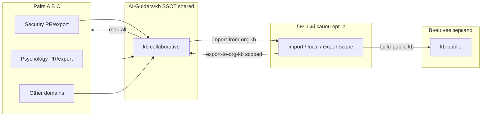

# ADR 011: GitHub-организация AI-Guiders и репозиторий совместной KB (`AI-Guiders/kb`)

> **Для любой другой org:** нормативный white-label onboarding — [`../domains/agent-operations/playbook-org-kb-white-label-v1.md`](../domains/agent-operations/playbook-org-kb-white-label-v1.md) (плейсхолдер `{ORG_SLUG}`). Этот ADR — **решение и история инстанса AI-Guiders**, не универсальная инструкция.

**Статус:** Accepted (2026-06-12)  
**Дата:** 2026-05-15  
**Именование GitHub:** org slug — **`AI-Guiders`** (с дефисом). Репозитории: `AI-Guiders/kb`, `AI-Guiders/kb-public`. Бренд/NuGet «AIGuiders» (без дефиса) — не путать с org slug.  
**Источник в истории:** перенос open-репозиториев в GitHub-организацию [AI-Guiders](https://github.com/AI-Guiders); запрос на отдельный **живой** контур KB для коллаборации (общие линии, совместное пополнение), не только read-only зеркало `kb-public`.  
**Supersedes:** —  
**Extended by:** —  
**Связано:** [001](001-kb-public-publishing-pipeline.md), [007](007-kb-project-constitution.md), [008](008-workspace-scope-map-hot-mcp-and-public-cut.md), [003](003-multi-project-scope-and-project-cards.md), [012](012-multi-canon-workspace-resolution-v1.md)

---

## Терминология (зафиксировать в обсуждениях)

| Термин | Где | Смысл |
|--------|-----|--------|
| **Личный канон** (chmod **u**) | `agent-notes` | SSOT владельца: `work/local/`, `personal/`, hot, полный `work/projects/`. |
| **Group KB** (chmod **g**) | репо **`AI-Guiders/kb`**, MCP `knowledge_root_id=group` | **SSOT общего знания:** пары (человек+агент) пишут PR/export; все читают. |
| **Org KB** | то же репо `AI-Guiders/kb` | Синоним в текстах про **GitHub org**, governance, `seed-org-kb.ps1`, **org-maintainer**. Не меняет MCP id (`group`). |
| **Public KB** (chmod **o**) | `AI-Guiders/kb-public` | Публичный срез; `public-kb.ignore`. |
| **Open-код** | `AI-Guiders/*` | MCP, IDE, Core — не текст KB. |

**Правило:** в ADR/MCP/ugo пишем **group KB**; **org KB** — только про репозиторий на GitHub и роли maintainers. Файл исключений seed: `knowledge/group-kb.ignore`.

Далее в ADR: **личный канон** вместо устаревшего «полный канон».

---

## Контекст

Сейчас в экосистеме фактически **три роли** контента знаний (+ код), но названия путаются — см. таблицу выше.

Появление **организации AI-Guiders** на GitHub поднимает вопрос: нужен ли **организационный** контур — репозиторий, куда **участники org** вносят общие линии (playbook/kb/worlds), с PR и review, **без** доступа к **личному канону** и **без** утечки машинных путей и слоя `knowledge/personal/`.

Ограничения, которые уже закреплены и не отменяем этим ADR:

- [001](001-kb-public-publishing-pipeline.md) — публичная сборка режется по `public-cut` и `public-kb.ignore`.
- [007](007-kb-project-constitution.md) — Privacy by Architecture, Router-First, SSOT в каноне.
- [008](008-workspace-scope-map-hot-mcp-and-public-cut.md) — карты workspace и операционный спринт **не** в kb-public hot.

Проблема без отдельного org-репо: либо коллаборанты пушат в **личный** `agent-notes` (нежелательно), либо работают только с **мертвым** zip/`kb-public` без нормального git-flow, либо дублируют знания в разрозненных README репозиториев кода.

---

## Цели (что хотим получить)

1. **Совместное пополнение** — общие playbook/kb, маршруты, worlds/domains, META (Integrity POST), онбординг — через PR в GitHub org.
2. **Общие линии** — согласованные формулировки принципов, протоколов `[HUMAN]`/`[WORK]`/`[PRIMARY]`, entry-структура ([009](009-kb-entry-structure-and-pre-open-onboarding.md)) без привязки к диску `C:\…`.
3. **Предсказуемый MCP** — у участника `AGENT_NOTES_CANON_PATH` (или fork) указывает на **клон org-kb**; `read_hot_context` / `read_knowledge_file` работают как с kb-public (manifest + контрактный hot).
4. **Разделение с личным каноном** — `work/local/`, `personal/`, карты workspace, hot ниже `public-cut` остаются **вне** org-kb; **`work/projects/`** — в org (обезличенные карточки).
5. **Предпосылка участника** — перед работой в мульти-scope workspace: свой `work/local/workspace-scope-map-v1.md` в **личном** каноне ([008](008-workspace-scope-map-hot-mcp-and-public-cut.md), [012](012-multi-canon-workspace-resolution-v1.md)).
6. **Совместимость** с существующим `kb-public` (не ломать потребителей read-only зеркала, пока не решим иное).

---

## Не-цели (явно не в scope ADR)

- Перенос **личного канона** (`agent-notes` целиком) в org — личное и машинное остаётся у держателя канона.
- Замена NuGet / MCP-репозиториев этим репо (код по-прежнему в отдельных репо).
- Автоматический двусторонний sync «любой PR в org-kb → сразу в личный канон» без review держателя канона.

---

## Варианты

### A. Только переименовать/перенести `kb-public` → `AI-Guiders/kb`

- Org-репо = тот же артефакт, что `build-public-kb.ps1`, пушится CI или скриптом с машины владельца.
- **Плюсы:** минимум новой механики; один источник правды для публичного среза.
- **Минусы:** коллаборанты **не пишут** в живой git напрямую (только PR в agent-notes у владельца → пересборка); org-kb остаётся зеркалом, не «местом работы».

### B. `AI-Guiders/kb` — **живой** collaborative repo (**принято**)

- Участники org (пары A/B/C по доменам) коммитят/мержат PR **в `AI-Guiders/kb`** в согласованных зонах (`knowledge/worlds/`, `knowledge/domains/`, router, META, шаблоны).
- **Routine sync из одного канона не затирает org:** steady state — PR или `export-to-org-kb.ps1`. Full replace — только `bootstrap-org-kb.ps1` или `seed-org-kb.ps1 -Push` (bootstrap/DR).
- Держатель **личного канона** **импортирует** из org (`import-from-org-kb.ps1`) когда хочет писать локально; **экспортирует** только свои paths — не весь `knowledge/`.
- **Плюсы:** настоящая коллаборация; понятный CONTRIBUTING; MCP на клон org.
- **Минусы:** риск **двух SSOT** без дисциплины; нужны CODEOWNERS, шаблон PR, возможно `knowledge/collab/` vs зоны только maintainer’ов.

### C. Org-kb как **upstream** для `kb-public`

- `AI-Guiders/kb` — живой; `KarataevDmitry/kb-public` (или release) — периодический **тегированный снимок** / GitHub Release zip для внешних без доступа к org.
- **Плюсы:** внешний мир не зависит от членства в org.
- **Минусы:** два шага публикации, если оба нужны.

---

## Предлагаемое решение (принято)

Принят **вариант B** (federation) с опциональным **C** для внешних зеркал:

### 0. Federation (пары и домены)

- **Org-first для shared:** общее знание развивается в `AI-Guiders/kb`; пары специализируются (Security, Psychology, open stack, …).
- **Read:** любой участник — clone org, MCP `knowledge_root_id=group`.
- **Write в org:** PR или `export-to-org-kb.ps1` (whitelist `knowledge/work/local/group-kb.export`, опционально).
- **Write в канон:** opt-in — `import-from-org-kb.ps1`, локальные правки, при необходимости export своей зоны обратно.
- **Запрещено в steady state:** full replace `knowledge/` из одного канона; bootstrap — `bootstrap-org-kb.ps1` / `seed-org-kb.ps1 -Push` (редко).

Runbook: [`../work/projects/door-to-singularity/agent-notes-kb/templates/runbook-org-kb-federation-v1.md`](../work/projects/door-to-singularity/agent-notes-kb/templates/runbook-org-kb-federation-v1.md).

### 1. Репозиторий

- **Имя:** `AI-Guiders/kb` (или `AI-Guiders/knowledge-base` — зафиксировать одно; ниже — `kb`).
- **Видимость:** private или public внутри org — **решение отдельно** (см. «Открытые вопросы»).
- **Лицензия:** выровнять с публичным срезом — **CC BY-SA 4.0** на текст KB в репо ([`PUBLISHING.md`](../PUBLISHING.md)); код в других репо — MIT, как сейчас.

### 2. Состав репозитория (начальный)

| Путь | В org-kb? | Примечание |
|------|-----------|------------|
| `agent-notes.md` (до `public-cut` + stub manifest) | да | тот же контракт, что kb-public |
| `knowledge/META/` (integrity, memory-architecture json, …) | да | без секретов |
| `knowledge/worlds/`, `domains/`, шаблоны, router, SHOWCASE, one-pager | да | зона коллаборации |
| `knowledge/work/projects/` | **да** | карточки `project-id`, scope; **без** `C:\`/`D:\` — чеклист [`../work/org/checklist-sanitize-paths-for-org-v1.md`](../work/org/checklist-sanitize-paths-for-org-v1.md) |
| `knowledge/work/org/` | **да** | scope contour map, чеклист санитизации, README; копируется целиком при seed |
| `knowledge/work/local/` | **нет в git** | только `README.md`, `*.example.*`, `.gitignore`; реальные map — у каждого в personal |
| `knowledge/personal/` | **нет** | |
| `knowledge/archive/` | **нет** (или отдельная политика) | |
| `knowledge/adr/` | **частично** | ADR про **продукт KB** — да; операционка с путями — нет или redacted |
| `scripts/` (`build-public-kb.ps1`, `push-public-kb.ps1`, `seed-org-kb.ps1`, `KbTextEncoding.ps1`, `README.md`, `kb-public-root/`, `kb-org-root/`) | **да** | зеркало канона для **canon-maintainer**; SSOT — репо **личного/командного канона** `agent-notes`; в **kb-public** не попадает |
| `knowledge/public-kb.push` | **нет** в org (по умолчанию) | локально у maintainer; шаблон `scripts/public-kb.push.example` |

Стартовое наполнение: **`scripts/seed-org-kb.ps1`** в каноне (или вручную: output `build-public-kb.ps1` + санитизированный `work/projects/` + корневые шаблоны + копия `scripts/`).

### 3. Потоки изменений (governance)

**Рекомендуемая модель «org-first для shared, federation пар, opt-in canon»:**

- **В org-kb:** прямые PR участников; review (1+ org-maintainer); CODEOWNERS по доменам — по мере роста.
- **В личный канон:** import выбранных paths; личное/пути **не** экспортируются в org без санитизации.
- **Bootstrap в org-kb:** `seed-org-kb.ps1 -Push` или `bootstrap-org-kb.ps1` — **не** routine; затирает весь `knowledge/`.
- **Экспорт scoped:** `export-to-org-kb.ps1` по `knowledge/work/local/group-kb.export` или `-Paths`.
- **Импорт:** `import-from-org-kb.ps1` по `knowledge/work/local/group-kb.import`.
- **Пуш kb-public** — отдельно, canon-maintainer(s).

**Запрещено по умолчанию:** коммит в org-kb файлов с путями `C:\`, `D:\`, имён собеседников, `work/local/workspace-scope-map` с реальными корнями.

### 4. MCP и hot-context

- Участник клонирует `AI-Guiders/kb`, в MCP: `AGENT_NOTES_CANON_PATH=<clone>`.
- Ожидание: как у kb-public после [008](008-workspace-scope-map-hot-mcp-and-public-cut.md) + stub manifest + `AIGuiders.AgentNotes.Core` ≥ 1.0.1 (`l0` из JSON, `l0_owner` без секций — не грузится).
- Scope: явный `active_scope`, **или** карта в **личном** primary (`work/local/workspace-scope-map-v1.md` при `AGENT_NOTES_CANON_PATH` = личный канон), **или** fallback в коде. Org-клон **без** закоммиченной карты — норма; работа в umbrella-workspace без local map — слабый режим (см. [012](012-multi-canon-workspace-resolution-v1.md)).

### 5. Связь с переносом open-репозиториев в org

- MCP, Core, CIDE, `mcp-tool-manifest` — репозитории **кода** в `AI-Guiders/*`.
- **`AI-Guiders/kb` — репозиторий текста знаний**, не смешивать с `agent-notes-mcp`.
- В README org и в kb: таблица «какой репо за что».

---

## Последствия

**Плюсы**

- Коллаборация без доступа к личному канону.
- Единая точка для «общих линий» и онбординга новых участников org.
- MCP и агенты работают на одном клоне без путаницы с kb-public mirror.

**Минусы / риски**

- **Дрейф** org-kb vs **личный канон**, если не зафиксировать import/export ритуал.
- Нужны maintainers и время на review PR.
- Публичность org-kb vs private org — влияет на то, можно ли форкать наружу без второго зеркала.

---

## План внедрения (если ADR принят)

1. ~~Создать `AI-Guiders/kb` (private org + LICENSE CC BY-SA).~~ **Сделано (2026-05-19):** https://github.com/AI-Guiders/kb — bootstrap (smoke, CONTRIBUTING, CODEOWNERS); полный `seed-org-kb.ps1` — позже.
2. Initial commit = `.\scripts\seed-org-kb.ps1` после `build-public-kb.ps1` и прохода [`checklist-sanitize-paths-for-org-v1.md`](../work/org/checklist-sanitize-paths-for-org-v1.md).
3. Шаблоны: `scripts/kb-org-root/CONTRIBUTING.md`, `CODEOWNERS`, `knowledge/work/local/.gitignore`.
4. Runbook: [`runbook-org-kb-federation-v1.md`](../work/projects/door-to-singularity/agent-notes-kb/templates/runbook-org-kb-federation-v1.md) (export/import/bootstrap).
5. Обновить `public-kb.push` / CI: целевой remote GitHub — **`AI-Guiders/kb-public`** (см. `knowledge/public-kb.push`); org `AI-Guiders/kb` — отдельный контур совместного канона.
6. Упоминание в `index-knowledge-router-v1.md` (секция router-org-kb) — после стабилизации имени репо.

---

## Решения (2026-06-12)

1. **Имя репозитория:** `kb` — принято.
2. **kb-public:** внешнее зеркало (вариант C); `AI-Guiders/kb-public` — канонический remote публичной сборки.
3. **Видимость `AI-Guiders/kb`:** private org (члены org); публичность — через kb-public.
4. **Кто может писать:** члены org — PR; merge через org-maintainer / CODEOWNERS.
5. **Обратный поток в канон:** opt-in `import-from-org-kb.ps1`; автоматический merge без review — нет.
6. **Роли:** org-maintainer (review org) vs canon-maintainer (kb-public, bootstrap) — разделены, можно совмещать.
7. **ADR в org-kb:** продуктовые ADR из public slice; операционка с путями — redacted или только в каноне.
8. **Зоны коллаборации:** `worlds/`, `domains/`, scoped `work/projects/`; federation по доменам; full wipe — только bootstrap.

## Открытые вопросы (исторические; см. «Решения» выше)

1. **Имя репозитория:** `kb` vs `knowledge-base` vs `agent-notes-kb`?
2. **kb-public на KarataevDmitry:** оставить как **внешнее зеркало** (вариант C), **архивировать** с redirect на `AI-Guiders/kb`, или **только** org-kb?
3. **Видимость `AI-Guiders/kb`:** public (форки, issues) или private org (только члены)?
4. **Кто может писать:** все члены org / только команда в CODEOWNERS / ветка `contributors/*`?
5. **Обратный поток в личный канон:** canon-maintainer вручную, или bot `org-kb → agent-notes` с label `import-candidate`?
6. **Роли:** **org-maintainer** (review в `AI-Guiders/kb`) vs **canon-maintainer** (скрипты, `public-kb.push`) — совмещать можно, но это разные зоны ответственности.
7. **ADR в org-kb:** все `knowledge/adr/*.md` из публичного среза или отдельный `adr/` только «продуктовые» без операционных путей?
8. **Зоны коллаборации:** достаточно `knowledge/worlds/**` + корневые index/playbook, или завести `knowledge/collab/**` для черновиков до промоции в worlds?

---

## Рекомендация автора ADR (для обсуждения)

- Репо: **`AI-Guiders/kb`**, public внутри org (или public GitHub, если цель — открытые общие линии).
- **`AI-Guiders/kb-public`:** канонический GitHub remote для публичной сборки kb-public (`public-kb.push`). Старый `KarataevDmitry/kb-public` — редирект GitHub.
- Governance: **PR в org-kb** + периодический **import** в **личный канон**; export script с тем же `public-kb.ignore`.
- В org-kb: `work/projects/` (санитизация путей), не `work/local/` (git), не `personal/`, не hot ниже cut.

---

## Статус принятия

**Accepted** 2026-06-12. Federation runbook: [`runbook-org-kb-federation-v1.md`](../work/projects/door-to-singularity/agent-notes-kb/templates/runbook-org-kb-federation-v1.md).
