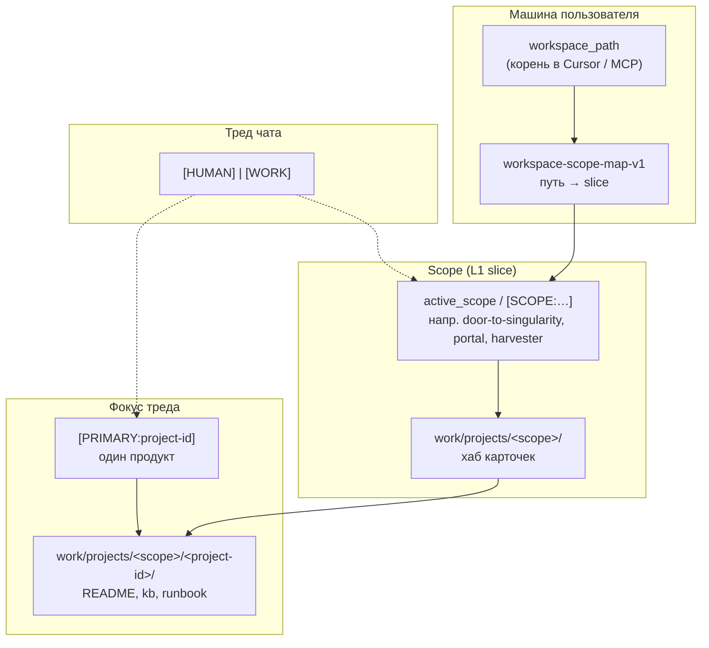
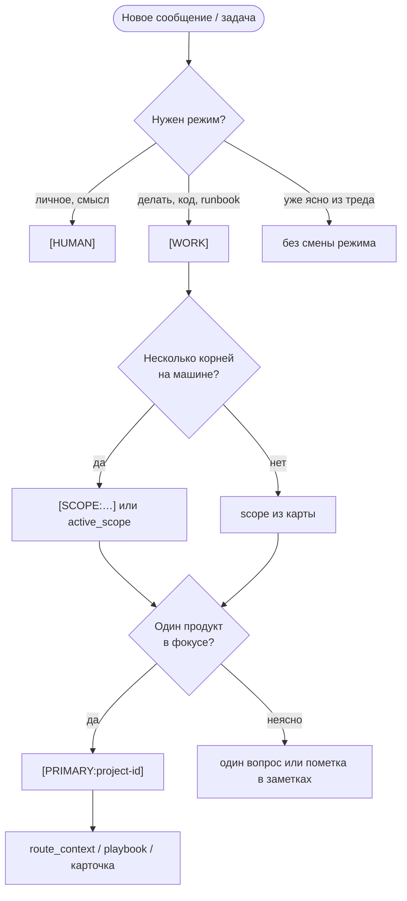

# One-pager: протоколы маркеров и сущности KB

**Версия:** v1 · **2026-05-16**  
**Для wiki kb-public:** эту страницу можно зеркалировать как **главный вход** «как пользоваться KB» (рядом с `SHOWCASE.md` и `index-knowledge-router-v1.md`).  
**Расширение:** устройство слоёв L0–L3, `work/` / `personal/` — в **`kb-one-pager-structure-and-protocols-v1.md`**.

---

## За 60 секунд

| Вопрос | Ответ |
|--------|--------|
| Что писать в чате? | Маркеры **`[HUMAN]`** / **`[WORK]`**, **`[PRIMARY:…]`**, **`[SCOPE:…]`** — см. таблицы ниже. |
| Что важнее? | Маркер в **этом** сообщении → дефолт из карты установки → эвристика по пути файла (не отменяет недавний маркер в треде). |
| Scope vs Primary? | **SCOPE** — «в какой вселенной workspace»; **PRIMARY** — «какой продукт в фокусе». |
| Где полный текст? | `worlds/workspace-context/playbook-multi-project-context-v1.md`; hot `agent-notes.md` (секции протоколов — в полном каноне, часто под `<!-- public-cut -->`). |

---

## Маркеры в сообщениях (шпаргалка)

### Режим треда: `[HUMAN]` и `[WORK]`

| Маркер | Когда | Что делает агент | По умолчанию |
|--------|--------|------------------|--------------|
| **`[HUMAN]`** | рефлексия, личное, эмоции, смысл, «поговорить» | не уходит в операционные runbook без запроса; уважает personal-контур | **да**, пока не появился `[WORK]` |
| **`[WORK]`** | задача, код, KB, runbook, «сделай», проверка, публикация | исполнение, инструменты, карточки проектов, чеклисты | после явного `[WORK]` в треде |

**Правило:** один тред — один устойчивый режим, пока не переключили маркером или явной фразой («переходим в work»).

**Полный текст:** секция **Mode Switch Protocol** в `agent-notes.md`.

---

### Фокус задачи: `[PRIMARY:…]` и `[SCOPE:…]`

| Маркер | Когда | Что задаёт | Пример |
|--------|--------|------------|--------|
| **`[PRIMARY:<id>]`** | один главный продукт/репо в фокусе **этого** треда | карточка `project-id`, пути в `work/projects/…`, техконтракт продукта | `[PRIMARY:cascade-ide]` или `[PRIMARY:CIDE]` |
| **`[SCOPE:<slice>]`** | на машине несколько корней workspace; нужен правильный **L1** hot-context | `active_scope` в MCP, scope-хаб в hot | `[SCOPE:door-to-singularity]` или `[SCOPE:DTS]` |

**Не путать:**

- **`[PRIMARY:EDWH]`** → репозиторий Harvester (`edw-harvester`).
- **`[SCOPE:HRV]`** → slice `harvester` (память L1), не то же самое, что PRIMARY.

**Алиасы** (опционально): короткие коды в чате нормализуются к канону — см. таблицу ниже. В долговечные записи в `knowledge/` пиши **канонический** `project-id` / scope.

**Приоритет резолва:**

1. Маркер в текущем сообщении (`[PRIMARY:…]`, `[SCOPE:…]`).
2. Дефолт из **`workspace-scope-map-v1`** (в hot `agent-notes.md` у владельца канона).
3. Эвристика по пути к файлу в чате — **не** должна молча перебивать маркер из шага 1 в том же треде.

**Полный протокол:** `project-switch-protocol-v1` в hot `agent-notes.md`; развёрнуто — `playbook-multi-project-context-v1.md` §6–6c.

---

## Сущности: что есть что (схема)

Термины **не взаимозаменяемы**.

**Кратко:**

| Сущность | Уровень | Зачем |
|----------|---------|--------|
| **workspace_path** | MCP / Cursor | физический корень репозитория на диске |
| **scope** (`active_scope`) | L1 оперативки | не смешивать monorepo DTS и отдельный корень Portal |
| **project-id** + **PRIMARY** | фокус задачи | одна карточка продукта, один техконтракт |
| **world** (KE) | домен роутера | стек/инструменты (Git, HCI, …) — **не** scope |
| **domain** (роутер) | тема запроса | какой playbook/kb подтянуть по словам задачи |

**Mixed worlds / transfer_boundary:** `worlds/knowledge-engineering/kb-knowledge-engineering-mixed-worlds-rules-v1.md`.

---

## Типовые scope и project-id (установка автора канона)

Значения **не глобальный стандарт** — у каждой установки свой список. Ниже — **пример** для workspace «Door to Singularity» (имена из публичного плейбука и quickref; полные пути к карточкам — в полном каноне под `work/`, в kb-public **нет**).

### Scope (`[SCOPE:…]` → канон)

| Маркер / legacy | Канонический scope | Когда выбирать |
|-----------------|-------------------|----------------|
| `DTS`, `current-projects` | `door-to-singularity` | домашний monorepo, open stack, DTS-хаб |
| `PTL` | `portal` | отдельный корень / линия Portal |
| `HRV` | `harvester` | EDW Harvester, не Portal |
| `mixed` | `mixed` | явно несколько slice в одной сессии |

### Primary — частые `project-id` (door-to-singularity)

| `[PRIMARY:…]` | Канон | Зачем |
|-------------|-------|--------|
| `CIDE` | `cascade-ide` | IDE Avalonia |
| `ANKB` | `agent-notes-kb` | канон KB, META, публикация |
| `ANM` | `agent-notes-mcp` | MCP agent-notes |
| `DTS` | `door-to-singularity` | хаб workspace (не отдельный продукт) |
| `FB` | `friction-book` | книга Friction |
| `AFG` | `agent-forge` | vision forge (репо может отсутствовать) |

Полная таблица алиасов: в полном каноне `work/projects/door-to-singularity/door-to-singularity/project-ids-quickref-v1.md` (в kb-public не входит).

---

## Инструменты MCP (не маркеры чата)

| Инструмент / параметр | Когда | Заметка |
|----------------------|--------|---------|
| **`read_hot_context`** | старт сессии, смена scope | L0/L1 срез без всего `knowledge/` |
| **`route_context(query)`** | «что грузить по теме» | router-first; не full load KB |
| **`read_knowledge_file`** | нужен конкретный playbook/kb | путь относительно `knowledge/` |
| **`active_scope`** | явно задать slice для MCP | альтернатива `[SCOPE:…]` в чате |
| **`knowledge_root_id=group`** | чтение **`{ORG_SLUG}/kb`** (private) | read-only; см. `playbook-org-kb-white-label-v1.md` |
| **`knowledge_root_id=public`** | чтение kb-public | read-only |
| **запись** | только **primary** (personal) | [ADR 012](adr/012-multi-canon-workspace-resolution-v1.md) |

---

## Когда что использовать (дерево решений)

---

## Связь с контурами организации

| Контур | Роль | Этот one-pager |
|--------|------|----------------|
| **kb-public** (`{ORG_SLUG}/kb-public`) | публичные playbook, роутер, этот файл | да |
| **group KB** (`{ORG_SLUG}/kb`, private) | командный канон | чтение `knowledge_root_id=group`; white-label: `playbook-org-kb-white-label-v1.md` |
| **handbook** (опционально) | миссия, ценности org | не маркеры KB |
| **personal** | личный канон участника | маркеры чата, `work/local/` |

---

## Куда дальше

| Нужно | Файл |
|--------|------|
| Анти-OOM обзор KB | `SHOWCASE.md` |
| Роутер по темам | `index-knowledge-router-v1.md` |
| Мультипроект, куда писать заметки | `worlds/workspace-context/playbook-multi-project-context-v1.md` |
| Слои L0–L3, публикация | `kb-one-pager-structure-and-protocols-v1.md` |
| Целостность | `META/integrity-core.md` |
| Multi-canon (личный + org) | `adr/012-multi-canon-workspace-resolution-v1.md` |
