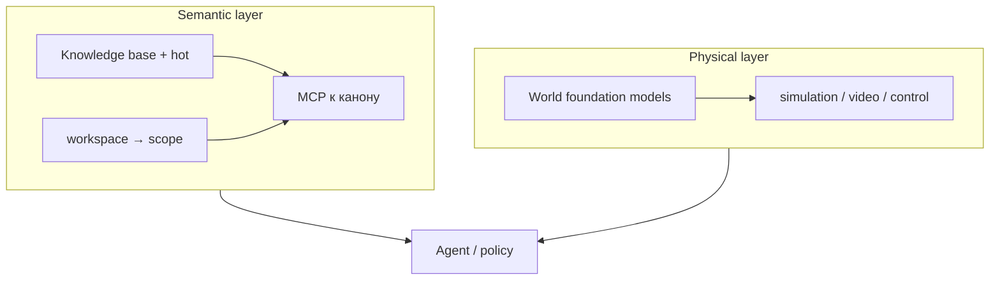

# Agent foundation: physical layer vs semantic layer (orientation)

**world:** `agent.orchestration`  
**Версия:** v1 · **2026-05-16**  
**transfer_boundary:** аналогия и терминология; **не** руководство по установке [NVIDIA Cosmos](https://github.com/nvidia-cosmos) и **не** замена домена `software.ml-applied`.

Расширенная рабочая заметка (внутренний контур, не kb-public): `knowledge/work/projects/door-to-singularity/door-to-singularity/note-physical-vs-semantic-cosmos-v1.md` — только в полном каноне с `work/`.

---

## Две части пазла → автономия

**Semantic** (наш контур: KB, hot, scope, MCP к корням знания) + **physical** (их контур: world foundation models, напр. [NVIDIA Cosmos](https://github.com/nvidia-cosmos)) = **автономия агента** в полном смысле: не только помнить и договариваться, но и опираться на мир, который ведёт себя как мир.

Без semantic — галлюцинации контекста («откуда это знание», какой проект в фокусе). Без physical — сильный план в вакууме для embodied-задач (робот, AV, симуляция). Слои **соседи**, не конкуренты.

---

## Зачем этот файл

Зафиксировать два способа **заземлить** агента — не «ещё один чат». Оба нужны в embodied-сценариях, но **не подменяют** друг друга.

| Слой | Что моделирует | Типичный SSOT |
|------|----------------|---------------|
| **Physical** | физика сцены: пространство, время, тела; video / control / embodied reasoning | чекпоинты WFMs, датасеты, cookbook (напр. Cosmos Predict / Transfer / Reason) |
| **Semantic** | согласованный **контекст**: память, scope, протоколы, карты workspace | KB (`knowledge/`), hot (`agent-notes.md`), явная установка MCP к корням знания |

**Правило:** physical отвечает на «что будет в сцене»; semantic — на «что сейчас важно, откуда читать, какой slice workspace».

---

## Схема

---

## Термины (не смешивать)

| Термин | В physical AI (Cosmos и аналоги) | В этой KB |
|--------|----------------------------------|-----------|
| **world** | симуляция физического мира | **`world`** в Knowledge Engineering — контур стека/инструментов; **`scope`** — slice workspace |
| **curate** | видео-пайплайн | жизненный цикл markdown, ревизии |
| **reason** | VLM по кадрам | `route_context`, playbook — не видео-reasoning |

См. также: `kb-knowledge-engineering-mixed-worlds-rules-v1.md`, `SHOWCASE.md` (scope / domain / world).

---

## Внешние ориентиры (physical)

- Организация: https://github.com/nvidia-cosmos  
- Обзор: https://www.nvidia.com/en-us/ai/cosmos/  

Документация и код Cosmos — **их** SSOT; этот файл только фиксирует **место слоя** рядом с semantic KB.

---

## Когда грузить

- путаница «world model» vs «world» в KE / `scope`;
- обсуждение стека агента (IDE + KB + embodied);
- **не** под установку GPU, датасетов Cosmos, post-training — туда внешние cookbook и `software.ml-applied` по задаче.
